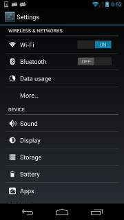

# FTT自动化测试工程说明文档-竖版Native #

**FTT Native介绍**
  - **[FTT Native](#FTT-Native)**

**FTT Native基本概念**  
  - **[FTTTestCase](#FTTTestCase)**
     - **[FTTTestCase使用方法](#FTTTestCase使用方法)**
     - **[FTTTestCase继承方式](#FTTTestCase继承方式)**
     - **[FTTTestCase执行方式](#FTTTestCase执行方式)**
  - **[FTTUISelector](#FTTUISelector)**
     - **[FTT native ui元素提取](#FTT-native-ui元素提取)**
     - **[FTTUISelector使用方式](#FTTUISelector使用方式)**
     - **[Selector使用方式](#Selector使用方式)**
  - **[FTTJob](#FTTJob)**
     - **[FTTJob实现方式](#FTTJob实现方式)**
     - **[FTTJob启动 暂停 恢复 停止](#FTTJob启动-暂停-恢复-停止)**
  - **[FTTAutomatorDevice](#FTTAutomatorDevice)**
     - **[FTTAutomatorDevice介绍](#FTTAutomatorDevice介绍)**
     - **[source](#source)**
     - **[wait_for_times](#wait_for_times)**
     - **[click_selector](#click_selector)**
     - **[wait_exists_and_enabled](#wait_exists_and_enabled)**
     - **[text](#text)**
     - **[swipe_to](#swipe_to)**
     - **[swipe_until](#swipe_until)**
     - **[watcher watchers](#watcher-watchers)**
     - **[wait_exists](#wait_exists)**
     - **[wait_gone](#wait_gone)**
     - **[get_centre](#get_centre)**
     - **[get_rect](#get_rect)**
     - **[screen_size](#screen_size)**

**FTT 竖版和分屏用例统一管理**
  - **[FTTTestCase管理方式](#FTTTestCase管理方式)**
  - **[竖版和分屏联合编写](#竖版和分屏联合编写)**

# FTT Native介绍
## FTT Native
FTT Native是基于开源三方库uiautomator[xiaocong uiautomator](https://github.com/xiaocong/uiautomator)二次封装

# FTT Native基本概念
## FTTTestCase
FTTTestCase是一个用来修饰类的装饰器，被修饰的类必须实现两个方法setup、cleanup。setup用来运行该用例的测试逻辑，cleanup用来清理本用例给环境带来的影响

## FTTTestCase使用方法
使用方式在类声明之前，加上@FTTTestCase
```python
@FTTTestCase
class TestCase(object):
    def __init__(self):
        pass

    def setup(self):
        pass

    def cleanup(self):
        pass
```

## FTTTestCase继承方式
#### FTTTestCase类继承普通经典类
```python
class Base(object):
    def __init__(self):
        self.count = 1

@FTTTestCase
class TestCase(Base):
    def __init__(self):
        super(FTTTestCase.inherit(TestCase),self).__init__()
    
    def setup(self):
        pass
    
    def cleanup(self):
        pass
```
#### FTTTestCase类继承FTTTestCase类
```python
@FTTTestCase
class TestCase1(object):
    def __init__(self):
        self.count = 1
    
    def setup(self):
        pass
    
    def cleanup(self):
        pass

@FTTTestCase
class TestCase2(FTTTestCase.inherit(TestCase1)):
    def __init__(self):
        FTTTestCase.super(TestCase2, self).__init__()
        
    def setup(self):
        pass
    
    def cleanup(self):
        pass
```

## FTTTestCase执行方式
#### FTTTestCase类会在实例化后依次调用 setup->cleanup方法
```python
@FTTTestCase
class TestCase(object):
    def __init__(self):
        self.count = 1
    
    def setup(self):
        print "in setup"
    
    def cleanup(self):
        print "in cleanup"
```
#### ``>>>> TestCase()``
#### ``>>>> in setup``
#### ``>>>> in cleanup``

# FTTUISelector
## FTT native ui元素提取

```xml
<node index="0" text="" resource-id="android:id/list" class="android.widget.ListView" ...>
  <node index="0" text="WIRELESS & NETWORKS" resource-id="" class="android.widget.TextView" .../>
  <node index="1" text="" resource-id="" class="android.widget.LinearLayout" ...>
    <node index="1" text="" resource-id="" class="android.widget.RelativeLayout" ...>
      <node index="0" text="Wi‑Fi" resource-id="android:id/title" class="android.widget.TextView" .../>
    </node>
    <node index="2" text="ON" resource-id="com.android.settings:id/switchWidget" class="android.widget.Switch" .../>
  </node>
  ...
</node>
```
---------------------------------------



#### FTT使用yaml语法格式对uiautomator selector定位方式进行二次封装，提取Android UI元素和代码分离。下面uiautomator可以使用对应FTT-selector代替

1. 
```python
# get the child or grandchild
d(className="android.widget.ListView").child(text="Bluetooth")
```

```yaml
# FTT-selector
grandchild:
  className: android.widget.ListView
  extand:
    method: child
    text: Bluetooth
```
---------------------------------------
2.
```python
d(className="android.widget.ListView", resourceId="android:id/list") \
  .child_by_text("Wi‑Fi", className="android.widget.LinearLayout") \
  .child(className="android.widget.Switch")
```

```yaml
# FTT-selector
wifi_switch:
  className: android.widget.ListView
  resourceId: android:id/list
  extand:
   method: child_by_text
   txt: Wi‑Fi
   className: android.widget.LinearLayout
   extand:
    method: child
    className: android.widget.Switch

```
---------------------------------------

3.
```python
d(text="Add new").child_by_instance(instance=0)
```

```yaml
add_new:
  text: Add new
  extand:
   method: child_by_instance
   instance: 0
  
```
---------------------------------------


## FTTUISelector使用方式
#### FTT使用yaml文件对native ui元素进行管理，使用之前必须载入相关yaml文件
```yaml
# 我的
my_tab:
  resourceId: com.iqiyi.ivrcinema.cb:id/id_tab_me
  extand:
    method: child
    text: 我的
    className: android.widget.TextView
```
---------------------------------------

```python
from common.NativeBaseUI import FTTDevice
FTTDevice.source = u"首页.yaml"
# 选取我的选项卡,使用uiautomator点击
FTTDevice.source('my_tab').click()

# 选取我的选项卡，等待其exists和enable为True时点击
FTTDevice.click_selector('my_tab')
```

## Selector使用方式
#### FTTUISelector将定位字段和定位方法提取出来，但是也不能满足所有需求，所以保留了原有的定位风格。
```python
from common.NativeBaseUI import FTTDevice
# 选取我的选项卡
FTTDevice(resourceId="com.iqiyi.ivrcinema.cb:id/id_tab_me")\
    .child(text="我的", className="android.widget.TextView")
```

# FTTJob
## FTTJob实现方式
FTTJob二次封装与python的threading.Thread，使用threading.Event()来实现线程的启动、暂停、恢复、停止

## FTTJob启动 暂停 恢复 停止
```python
def func():
  print "in func"
  
from client import FTTJob
# 每个1秒运行一次func函数
job = FTTJob(name="FTTJobTest",target=fnc, interval=1)
```
#### ``>>>> job.run() 启动``
#### ``>>>> job.pause() 暂停``
#### ``>>>> job.resume() 恢复``
#### ``>>>> job.stop() 停止``

# FTTAutomatorDevice
## FTTAutomatorDevice介绍
FTTAutomatorDevice是对uiautomator中的AutomatorDevice的重新封装，针对ftt-selector增加了一些对应的方法，并重写了watcher和watchers方法

## source
```python
from common.NativeBaseUI import FTTDevice
# 元素页面切换
FTTDevice.source = u"首页.yaml"
```
---------------------------------------

## wait_for_times
```python
@wait_for_times(count=10, interval=1,error="等待{}秒后函数还是返回False".format(count*interval))
def func():
   return Flase
```
#### ``>>>> func()``
#### ``>>>> 等待10秒后函数还是返回False``

---------------------------------------

## click_selector
```yaml
# 我的
my_tab:
  resourceId: com.iqiyi.ivrcinema.cb:id/id_tab_me
  extand:
    method: child
    text: 我的
    className: android.widget.TextView
```

```python
from common.NativeBaseUI import FTTDevice
FTTDevice.source = u"首页.yaml"
# 选取我的选项卡，等待其exists和enable为True时点击
FTTDevice.click_selector('my_tab')
```
---------------------------------------

## wait_exists_and_enabled
```python
from common.NativeBaseUI import FTTDevice
FTTDevice.source = u"首页.yaml"
# 等待我的选项卡exists和enable为True
FTTDevice.wait_exists_and_enabled('my_tab')
```

## text
```python
from common.NativeBaseUI import FTTDevice
FTTDevice.source = u"首页.yaml"
# 等待我的选项卡exists和enable为True
FTTDevice.text('my_tab')
```
#### ``>>>> 我的``


## swipe_to
```python
# 从ftt ui selector的_from目标滑动到_to目标,以stps为步长
FTTDevice.swipe_to("_from","_to", steps=50)
```


## swipe_until
```python
# 从experience_device_first选择一个方向滑动到my_unknow_device存在为止
swipe_until.up('_from', '_to')
swipe_until('up', '_from', '_to')

swipe_until.down('_from', '_to')
swipe_until('down', '_from', '_to')

swipe_until.left('_from', '_to')
swipe_until('left', '_from', '_to')

swipe_until.right('_from', '_to')
swipe_until('right', '_from', '_to')
```

## watcher watchers
#### 使用python线程重写uiautomator的watcher方法，提高灵敏度。
```python
# 新建一条ftt-watcher
FTTDevice.watcher(name="konw", interval=5)\
    .when(text='知道了').when(textContains="转动手机").click(text="知道了")

FTTDevice.watcher(name="continue", interval=5)\
    .when(textContains="当前选择的眼镜设备").when(text="继续").click(text="继续")

# 运行对应名字的watcher
FTTDevice.watchers.run("konw")

# 移除对应名字的watcher
FTTDevice.watchers.remove("konw")
```

## wait_exists
```python
# 在一定时间内等待控件出现.等待我的选项卡存在
FTTDevice.wait_exists(name="my_tab",timeout=5000)
```

## wait_gone
```python
# 在一定时间内等待控件消失.等待我的选项卡存在
FTTDevice.wait_gone(name="my_tab",timeout=5000)
```

## get_centre
```python
# 获取ftt ui selector获取中心点的坐标。获取我的选项卡控件的中心点的坐标
FTTDevice.get_centre(name="my_tab")
```

## get_rect
```python
# 获取ftt ui selector的矩阵大小.获取我的选项卡控件的可视矩阵的四点坐标
FTTDevice.get_rect(name="my_tab")
```

## screen_size
```python
# 返回手机屏幕尺寸
FTTDevice.screen_size()
```

# FTT 竖版和分屏用例统一管理
## FTTTestCase管理方式
#### 为了使VR分屏和竖版用例管理统一，竖版也使用XML来进行用例管理。如下是XML使用CUSTOM关键字管理TestCase1的示例
```xml
<var set="1" lvl="2" vid="1" dsc="启动时间-1" permutation="rows">
    <cluster dsc="验证并点击跳过按钮" module="workspace.leoche.vscript.start_time" exec="CUSTOM(TestCase1)" repetition="1" flow="setup"/>
    <include xml="UI\配置" id="系统配置" distinct="True"/>
</var>
```
---------------------------------------
```python
from client import get_var_record, FTTAssert
from client import FTTTestCase
from common.NativeBaseUI import NativeOptions, FTTDevice

index_page = u"workspace/layout/ui/首页.yaml"
FTTDevice.source = index_page

@FTTTestCase
class TestCase1(object):
    def __init__(self):
        self.package = get_var_record("app包名")
        # 清理环境
        NativeOptions.clear_launch_app(self.package)

    def setup(self):
        '''
        app启动后点击跳出按钮，进入首页
        :return:
        '''
        FTTDevice.click_selector('skip_btn')
        # 有视频选卡出现
        FTTAssert.assertTrue(FTTDevice.wait_exists_and_enabled('video_tab'))

    def cleanup(self):
        # 关闭app
        NativeOptions.close_app(self.package)

```

## 竖版和分屏联合编写
#### 可以在XML用例中使用<cluster/>标签对分屏中的接口进行引用而编写分屏用例脚本
